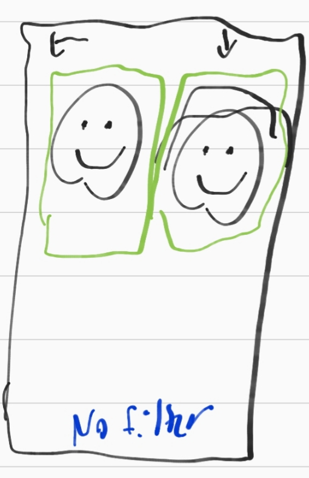

# SketchEase
Alexander Summers

Vision Statement: 

An application which allows the user to take a picture of faces, and then sketches them in a certain way using a filter.

Feature List:

Take a picture of one or more faces

Load a picture with one or more faces in it from your camera roll

Apply one of multiple filters to each face in a given image

Undo or switch applied filters

Share pictures with friends, or save images to the camera roll

Potential extension: adjust bounding box area of each face manually if necessary

Potential extension: sketch a face in motion, and record video

UI Sketch:

Main Screen: here users can select to either take a new picture or use a preexisting one from their camera roll.

Camera Screen: users can take a picture of themselves or others.

Photo filter: users can apply one of various sketch filters to the faces in the photograph they've taken or loaded.

Key Use Cases:

Take new photo:

1. On Main screen, press take new.
2. Press camera button to take photo.
3. Choose the filter for the face(s) in the photo.
4. (Optional) repeat the process until a filter is found that is suitable
5. Share or save the photo

Use existing photo:

1. On Main screen, press choose existing.
2. Choose the filter for the face(s) in the photo.
3. (Optional) repeat the process until a filter is found that is suitable
5. Share or save the photo

Domain Analysis:

The application is a computer vision app, this is an app which uses artificial intelligence to perform tasks a human might on images. 

In this case, the computer vision is performing object classification, which draws boxes (called bounding boxes) around areas of the image that might be a particular object. This computer vision is performed by the Apple Vision library.

A potential extension of our application would allow the user to apply the same filter to a face in motion. The idea of applying a filter in essentially real time is called augmented reality. 

Architecture:

Model:

Views and Controllers:

The app will be wrapped in a navigation controller. 

The first view will be a static view with title and buttons linked to a Camera view and a Gallery view.

Once an image is taken or selected respectively, there will be a View displaying an Image with different touchable overlay boxes, offering the user the ability to apply different filters for different faces contained within those boxes. Applying these filters wll update the image accordingly. When a filter is applied, the box around the face in question will change to indicate that a filter has been applied, and the box can be tapped again to either change or remove the filter. From this screen there will also be buttons allowing the user to send the image or save the image.

Testing Plan:

For the model, I will take a slightly modified bottom up testing approach. 

First, I will use a stub for the Image class to test FaceDetector to test use of the Apple Vision framework. 

Then I will implement the full Image class and integrate with FaceDetector.

Next, I will implement Filter and test using on an Image.

Finally, I will implement FilteredImage and test that.

For the view, I will test the different use cases manually in iOS simulator.
